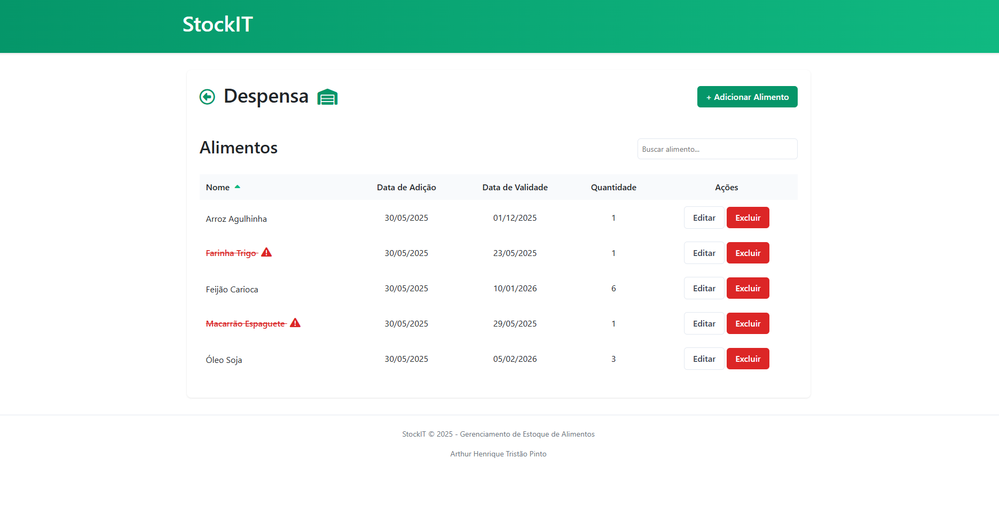

# 🧊 StockIT

Sistema de **controle de estoque doméstico e organizador de alimentos**, com interface intuitiva para ambientes como geladeira e despensa. Ideal para evitar desperdício e acompanhar prazos de validade.

# 📸 Preview

## 🧩 Funcionalidades

- Visualização de alimentos por ambiente (geladeira, despensa, etc.)
- Cadastro de novos alimentos com:
  - Nome, tipo, imagem, quantidade, validade e categoria
- Indicação de alimentos vencidos ⚠️
- Edição e exclusão de itens com facilidade
- Filtro de busca inteligente com normalização de texto
- Ordenação alfabética dos alimentos
- Integração com **JSON Server** para simular API completa
- Compatível com deploy em serviços como **Render** e **GitHub Pages**

## 💡 Tecnologias Utilizadas

- HTML5
- CSS3
- JavaScript (puro)
- Bootstrap 5
- JSON Server (RENDER)

## 🧑‍💻 Autor
- Arthur Henrique Tristão Pinto  
- Estudante de Ciência da Computação na PUC Minas  
- Desenvolvedor focado em soluções práticas e funcionais para web

## Contatos

### 📧 [Email](mailto:arthurhtp20@gmail.com)  
### 🔗 [LinkedIn](https://www.linkedin.com/in/arthurhtp)
